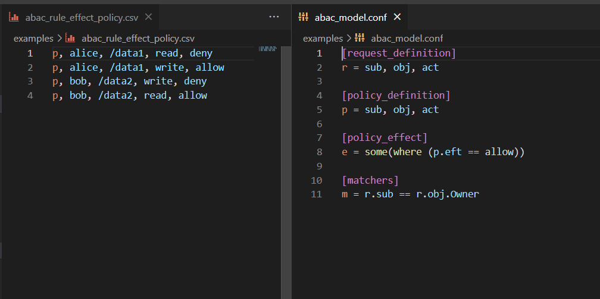

# casbin-vscode-plugin

Plugin for editing Casbin model and policy in VSCode.

## Provides:

- syntax highlighting

## Editor Show

## TODO LIST

* [ ] auto-completion for policy effect definitions and object attributes
* [ ] quick fixes to add missing attributes to models
* [ ] casbin executor tool window